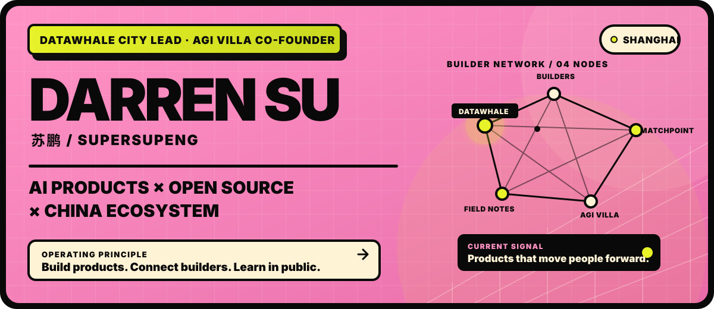

  

# Darren Su (苏鹏)

**AI Product Builder & China AI Ecosystem Operator — Shanghai, China**

Darren Su (苏鹏, [@SuperSupeng](https://github.com/SuperSupeng)) is a Shanghai-based AI product builder and China AI ecosystem operator. He is a **Datawhale City Lead**, **co-founder of AGI Villa**, and the builder behind **MatchPoint** and **GlobalTechEvents**.

I help global AI, robotics, hardware, and open-source teams understand China, connect with relevant builders and partners, and test ideas through real products, field feedback, and community programs.

苏鹏常驻上海，专注于 AI 产品构建、开源社区与中国科技生态连接，通过真实产品、社区项目和一线反馈，让想法更快落地。

[Personal website & field notes](https://www.darren-su.com/en) · [MatchPoint](https://matchpoint.careers) · [Datawhale](https://github.com/datawhalechina) · [GlobalTechEvents](https://globaltechevents.xyz)

> **Build products. Connect builders. Learn in public.**

## Building MatchPoint

### [MatchPoint — AI career exploration grounded in human evidence](https://matchpoint.careers)

MatchPoint helps people find work worth exploring through AI career conversations, job-specific deep dives, and traceable behavioral evidence—not just résumé keywords.

- **For people:** clarify strengths, explore roles, and build evidence they can understand and control.
- **For AI agents:** access career context through an MCP-compatible product surface.
- **Design principle:** AI assists the decision; the person keeps agency.

[Explore MatchPoint](https://matchpoint.careers)

## Datawhale Open Source & Community

As a **Datawhale City Lead**, I help turn open-source AI knowledge into local programs, contributor relationships, and learning experiences. My Datawhale work spans community building, project leadership, open collaboration, and learning in public.

- **[VCED — Video Clip Extraction by Description](https://github.com/datawhalechina/vced):** project lead for an open-source multimodal search and video editing project.
- **[DOPMC](https://github.com/datawhalechina/DOPMC):** open project governance, contributor coordination, and public collaboration.
- **[Team Learning](https://github.com/datawhalechina/team-learning):** structured collaborative learning across AI and software topics.
- **[Datawhale](https://github.com/datawhalechina):** an AI-focused open-source community built around “for the learner.”

## Building Communities and Field Infrastructure

### [AGI Villa — AI Builder Accelerator](https://agivilla.feishu.cn/wiki/ArG4wXniVi5A2lkAIf9coosLnKc?from=from_copylink)

As co-founder of AGI Villa, I work with builders turning early ideas into shipped AI products, hardware experiments, and open-source projects through community-led execution.

### [GlobalTechEvents — a living map for global builders](https://github.com/SuperSupeng/GlobalTechEvents)

GlobalTechEvents maps technology events for founders, builders, digital nomads, and remote workers looking for the right communities around the world.

[Browse the GlobalTechEvents map](https://globaltechevents.xyz)

## China AI Field Notes

I write about **China AI, robotics, hardware, supply chains, open-source communities, and field-level market signals**—with an emphasis on what builders can actually use.

[Read Darren Su's field notes](https://www.darren-su.com/en)

---

**Darren Su / 苏鹏 / SuperSupeng** · Shanghai, China

[Website](https://www.darren-su.com/en) · [GitHub](https://github.com/SuperSupeng) · [Datawhale](https://github.com/datawhalechina)
