<p align="center">
  
</p>

# Darren Su / SuperSupeng

**AI Builder · [Datawhale](https://github.com/datawhalechina) Contributor · Founder of [AGI Villa](https://agivilla.feishu.cn/wiki/ArG4wXniVi5A2lkAIf9coosLnKc?from=from_copylink) · Open-source Community Builder**

I build **AI agents, digital organizations, and AI-native products**, and help builders turn ideas into working systems through open-source collaboration.

我专注于 **AI Agent、数字组织、AI 原生产品和开源社区建设**，让想法通过产品与社区协作真正运行起来。

`location: Shanghai, China` · `status: building in public`

## `$ tree ~/datawhale`

My open-source journey is deeply connected with **Datawhale**, where I work across open-source governance, team learning, AI education, and contributor collaboration.

```text
datawhale/
├── DOPMC/          open-source project governance
├── team-learning/  community-led learning programs
├── hire-your-ai/   digital coworkers & AI agent teams
└── community/      contributors · education · incubation
```

- **[DOPMC](https://github.com/datawhalechina/DOPMC)** — contributing to open-source project governance and the Datawhale Open-source Project Management Committee.
- **[Team Learning](https://github.com/datawhalechina/team-learning)** — supporting cohort-based, community-led AI learning.
- **[Hire Your AI](https://github.com/SuperSupeng/hire-your-ai)** — content initiator of an open-source learning program for building digital coworkers and AI agent teams.

> Datawhale shaped how I think about open-source governance, AI education, contributor growth, and community-driven product incubation.

## `$ ps --active`

```text
PID   STATUS    SYSTEM             MISSION
001   RUNNING   AGI_VILLA          help AI builders ship real products
002   LIVE      MATCHPOINT         help people find roles worth exploring
003   BUILDING  SUPERCLAW          make digital organizations programmable
004   LEARNING  HIRE_YOUR_AI       teach people to build digital coworkers
```

## `$ ls ~/featured-projects`

| Project | What it does |
| --- | --- |
| **[MatchPoint](https://matchpoint.careers)** | An agent-native career exploration and job application system that uses AI conversations and traceable behavioral evidence to help people find roles worth exploring. It can also connect directly with Codex, Claude Code, and other MCP-compatible agents. |
| **[SuperClaw](https://github.com/SuperSupeng/SuperClaw)** | A TypeScript framework for digital organizations with AI roles, reporting lines, async collaboration, channels, and memory. |
| **[Hire Your AI](https://github.com/SuperSupeng/hire-your-ai)** | An open-source Datawhale learning program for building digital coworkers and AI agent teams—not merely better prompts. |
| **[Global Tech Events](https://github.com/SuperSupeng/GlobalTechEvents)** | A global event discovery platform for founders, builders, digital nomads, and remote workers. **[Visit →](https://globaltechevents.xyz)** |
| **[AI Application Development for Beginners](https://github.com/SuperSupeng/AI-Application-Development-for-Beginners)** | A practical, project-based guide to vibe coding and end-to-end AI application development. |
| **[Agent Store](https://github.com/SuperSupeng/Agent-Store)** | A discovery and enablement layer for AI agents, prompts, workflows, and reusable skill stacks. |

## `$ cat current_focus.txt`

- Designing **multi-agent systems and digital organizations** with memory, delegation, reporting lines, and human oversight.
- Building **agent-native career infrastructure** where people can explore roles and preserve evidence without being reduced to opaque scores.
- Turning early ideas into **deployed AI-native products** through rapid validation and iteration.
- Exploring **AI + hardware interfaces** and new ways for intelligence to interact with the physical world.
- Building **open-source learning systems and builder communities** that help more people ship meaningful work.

## `$ connect --all`

[Website](https://darren-chi.vercel.app) · [Repositories](https://github.com/SuperSupeng?tab=repositories) · [Datawhale](https://github.com/datawhalechina) · [AGI Villa](https://agivilla.feishu.cn/wiki/ArG4wXniVi5A2lkAIf9coosLnKc?from=from_copylink)

```text
Darren@SuperSupeng:~$ _
```
