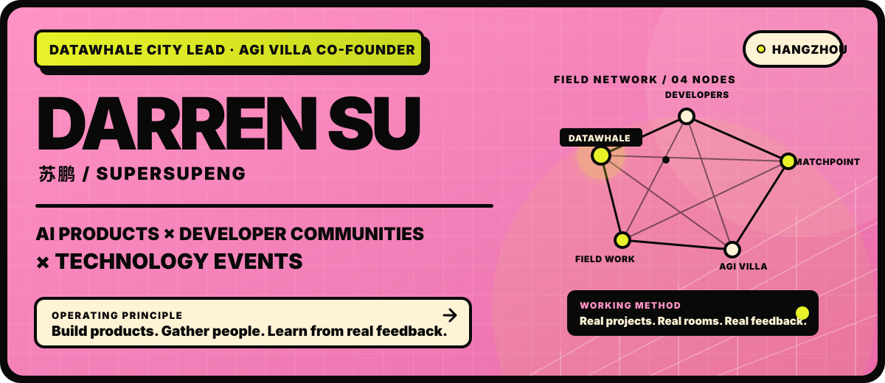

  

# Darren Su (苏鹏)

**Co-founder @ MatchPoint & AGI Villa · Head of City Ecosystem @ Datawhale · n8n Ambassador · Host of Re:Organize 《重新组织》**

AI product builder and developer ecosystem organizer based in Hangzhou, China. I organize developer programs across China, help early AI products meet their first users, and keep building products of my own.

**[X @zenshipai](https://x.com/zenshipai)** · **[Substack: China AI, On the Ground](https://darrensu101.substack.com)** · **[Website: darren-su.com](https://darren-su.com)** · **[MatchPoint](https://matchpoint.careers)**

苏鹏，常驻杭州。MatchPoint / AGI Villa 联合创始人，Datawhale 城市生态负责人，n8n Ambassador，播客《重新组织》主理人。

## Selected Work

| Project | My role | Result |
| --- | --- | --- |
| [AI+X Creation Festival](https://www.darren-su.com/en/work/aix-creation-festival) | Initiator and program lead | A coordinated developer program across **40 cities in China** |
| [Rumata Product Co-creation Workshop](https://www.darren-su.com/en/work/rumata-workshop) | Initiator and program lead | Around **50 participants** completed a first round of hands-on product feedback |
| [SuperAI's China Visit](https://www.darren-su.com/en/work/superai-china) | Ecosystem partner and local liaison | Visits and exchanges across **Hangzhou, Shanghai, and Singapore** |
| [A Digital Organization with 31 Agents](https://www.darren-su.com/en/work/agent-speaking) | Author and invited speaker | A real working system that led to talks and collaboration invitations |

[All projects and case studies](https://www.darren-su.com/en/projects)

## Building Products

### [MatchPoint — career exploration grounded in human evidence](https://matchpoint.careers)

MatchPoint grew out of repeated conversations with founders about hiring. It helps people explore roles and represent how they think and act through AI career conversations, job-specific deep dives, and traceable behavioral evidence. The product is live at [matchpoint.careers](https://matchpoint.careers).

**AI CAREER CONVERSATIONS** · **TRACEABLE EVIDENCE** · **MCP** · **HUMAN AGENCY**

### Other live products

- **[GlobalTechEvents](https://www.globaltechevents.xyz):** a global technology event index for founders, builders, digital nomads, and remote communities.
- **[Datawhale AI+X Events](https://aixevents.datawhale.cn):** a community calendar for practical AI meetups, workshops, hackathons, and co-creation programs.

## Datawhale, Open Source, and Developer Communities

I joined **Datawhale** in 2019 as an AI learner, then became a contributor, teaching assistant, organizer, and later **Head of City Ecosystem**. The work taught me to see community as more than distribution: it is where trust, useful feedback, and opportunities become visible.

- **[Datawhale city and developer ecosystem](https://www.darren-su.com/en/work/datawhale-city-ecosystem):** city programs and developer community work across China.
- **[VCED](https://github.com/datawhalechina/vced):** project lead for an open-source multimodal search and video editing project.
- **[DOPMC](https://github.com/datawhalechina/DOPMC):** open project governance and contributor collaboration.
- **[Team Learning](https://github.com/datawhalechina/team-learning):** structured, community-led learning across AI and software topics.

As **AGI Villa co-founder**, I work with AI founders and builders turning early ideas into products, workshops, and projects that can meet real users. I am also an **n8n Ambassador**.

## Podcast

**Re:Organize / 《重新组织》** — conversations with founders and operators about people, talent, and organizations in the AI age.

## Engineering Roots

**TiCDC at PingCAP → AI infrastructure and vector databases → Datawhale → AGI Villa → MatchPoint**

I started from engineering and still use that discipline in community and product work: understand how something is actually used, make the problem specific, and test it in the real world.

## Writing

**[China AI, On the Ground](https://darrensu101.substack.com)** (Substack) — a ground-level guide to China's AI ecosystem for global founders and builders.

On my website, I write after projects, products, and experiments have produced something worth examining:

- [How Can Personal Experience Become an Asset in the AI Era?](https://www.darren-su.com/en/blog/turning-expertise-into-an-asset)
- [Managing 31 AI Employees Changed How I Understand Management](https://www.darren-su.com/en/blog/managing-31-ai-employees)
- [Five Observations from Accompanying the SuperAI Team in Hangzhou and Shanghai](https://www.darren-su.com/en/blog/superai-china-ecosystem-visit)

[All writing on darren-su.com](https://www.darren-su.com/en/blog) · [About Darren](https://www.darren-su.com/en/about)

---

**Darren Su / 苏鹏 / SuperSupeng** · Hangzhou, China

[X](https://x.com/zenshipai) · [Substack](https://darrensu101.substack.com) · [Website](https://darren-su.com) · [Projects](https://www.darren-su.com/en/projects) · [MatchPoint](https://matchpoint.careers) · [GitHub](https://github.com/SuperSupeng) · [Datawhale](https://github.com/datawhalechina)
